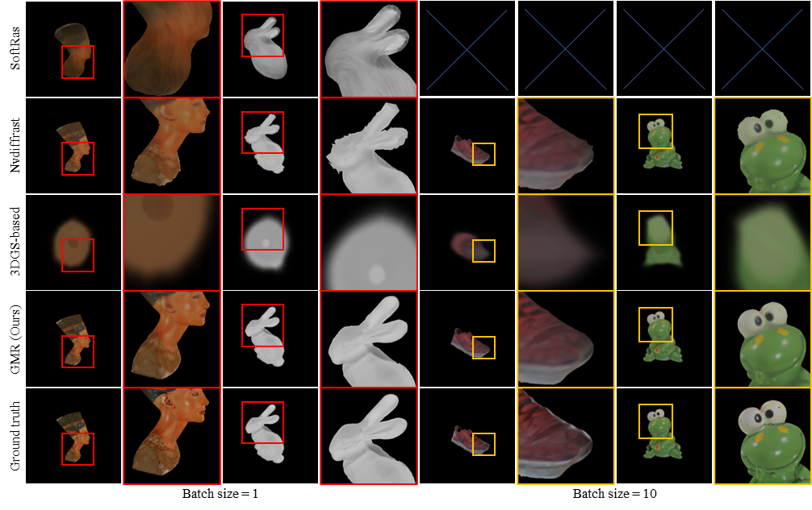

# Gaussian-Mesh-Renderer
Gaussian Mesh Renderer for Lightweight Differentiable Rendering (ICASSP2026)
## Xinpeng Liu<sup>1</sup>, Fumio Okura<sup>1</sup>  <br> <sup>1</sup> The University of Osaka<br>
[]([https://arxiv.org/abs/2503.19232](https://arxiv.org/pdf/2602.14493))



Abstract: *3D Gaussian Splatting (3DGS) has enabled high-fidelity virtualization with fast rendering and optimization for novel view synthesis. On the other hand, triangle mesh models still remain a popular choice for surface reconstruction but suffer from slow or heavy optimization in traditional mesh-based differentiable renderers. To address this problem, we propose a new lightweight differentiable mesh renderer leveraging the efficient rasterization process of 3DGS, named Gaussian Mesh Renderer (GMR), which tightly integrates the Gaussian and mesh representations. Each Gaussian primitive is analytically derived from the corresponding mesh triangle, preserving structural fidelity and enabling the gradient flow. Compared to the traditional mesh renderers, our method achieves smoother gradients, which especially contributes to better optimization using smaller batch sizes with limited memory.*

<section class="section" id="BibTeX">
  <div class="container is-max-desktop content">
    <h2 class="title">BibTeX</h2>
    <pre><code>@article{liu2026gaussian,
          title={Gaussian Mesh Renderer for Lightweight Differentiable Rendering},
          author={Liu, Xinpeng and Okura, Fumio},
          journal={arXiv preprint arXiv:2602.14493},
          year={2026}
}</code></pre>
  </div>
</section>

## Cloning the Repository

The repository contains submodules, thus please check it out with 
```shell
# SSH
git clone git@github.com:huntorochi/Gaussian-Mesh-Renderer.git
```
or
```shell
# HTTPS
git clone https://github.com/huntorochi/Gaussian-Mesh-Renderer.git
```

## Overview
This repository provides an **early-release** implementation of **Gaussian Mesh Renderer (GMR)**, a lightweight differentiable mesh renderer built on top of the efficient rasterization pipeline of **3D Gaussian Splatting (3DGS)**.


## Dataset

### Download
Please download the dataset from [**Google Drive**](https://drive.google.com/file/d/1Ist_sJDMB9HkY8lf9lO70qU_6GKXqF0N/view?usp=sharing). After downloading, place and unzip the dataset under:

```
Gaussian-Mesh-Renderer/
└── github_cache/
    └── Objaverse/
        └── other_e572_Black
```

## Installation

⚠️ **This is a fast-published early version.**  
We did **not** prepare a curated `requirements.txt` yet. Please install dependencies manually.

Most dependencies are common Python libraries used in vision / geometry pipelines, including (non-exhaustive):
- `torch`, `torchvision`
- `numpy`, `scipy`, `scikit-learn`
- `opencv-python`
- `open3d`
- `tqdm`
- `plyfile`
- `gsplat` (for rasterization / 3DGS)

## Notes / Limitations (Early Release)

This repository is a quick release aimed at providing an early baseline for external users.

Code may contain:
- limited documentation
- dataset-specific assumptions
- minimal refactoring / cleanup

We welcome issues and PRs, but please note that the repo's structure may change as we prepare a polished release.
